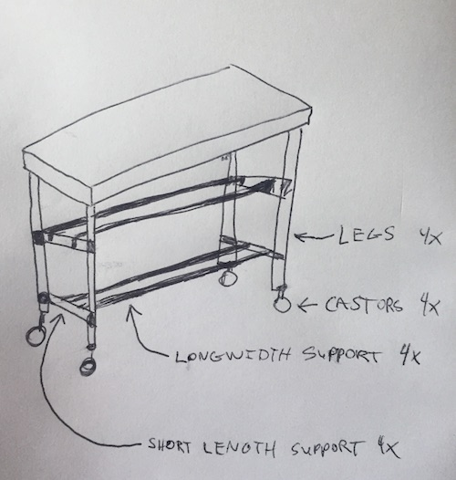

# The Chopping Block

We need to build the base for a chopping block and decided on using kee klamp and paired pipe for construction. We've agreed on a design, but wanted to ensure we have the correct measurements before we place our order.

## Target Dimensions

The desired table dimensions are as follows:

| dimension | value |
|-----------|-------|
| width     | 84"   |
| length    | 36"   |
| height    | 35"   |

## Design

Sorry for my terrible drawing, it was a bit back of the napkin, but this project is really just about getting dimeions.

